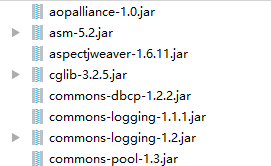
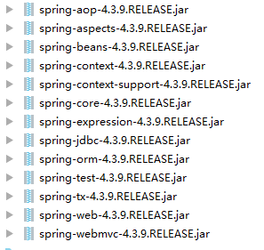

[TOC]

# MyBatis学习笔记

这个项目主要是 Mybatis 和 spring的整合，和这个项目相关的项目是

[https://github.com/wimingxxx/mybatislearn](https://github.com/wimingxxx/mybatislearn)

来自上面这个项目的笔记是

[SSH与SSM学习之MyBatis01——MyBatis简介](https://github.com/wimingxxx/mybatislearn/blob/master/blog/01.md)

[SSH与SSM学习之MyBatis02——使用jdbc编程问题总结](https://github.com/wimingxxx/mybatislearn/blob/master/blog/02.md)

[SSH与SSM学习之MyBatis03——Mybatis架构](https://github.com/wimingxxx/mybatislearn/blob/master/blog/03.md)

[SSH与SSM学习之MyBatis04——Mybatis基本使用](https://github.com/wimingxxx/mybatislearn/blob/master/blog/04.md)

[SSH与SSM学习之MyBatis05——根据用户名称模糊查询用户信息](https://github.com/wimingxxx/mybatislearn/blob/master/blog/05.md)

[SSH与SSM学习之MyBatis06——用户添加](https://github.com/wimingxxx/mybatislearn/blob/master/blog/06.md)

[SSH与SSM学习之MyBatis07——用户删除和更新](https://github.com/wimingxxx/mybatislearn/blob/master/blog/07.md)

[SSH与SSM学习之MyBatis08——与Hibernate的区别和小结](https://github.com/wimingxxx/mybatislearn/blob/master/blog/08.md)

[SSH与SSM学习之MyBatis09——Dao1原始Dao方式开发](https://github.com/wimingxxx/mybatislearn/blob/master/blog/09.md)

[SSH与SSM学习之MyBatis10——Dao2使用mapper代理的方式](https://github.com/wimingxxx/mybatislearn/blob/master/blog/10.md)

[SSH与SSM学习之MyBatis11——SqlMapConfig.xml](https://github.com/wimingxxx/mybatislearn/blob/master/blog/11.md)

[SSH与SSM学习之MyBatis12——输入和输出映射](https://github.com/wimingxxx/mybatislearn/blob/master/blog/12.md)

[SSH与SSM学习之MyBatis13——动态SQL](https://github.com/wimingxxx/mybatislearn/blob/master/blog/13.md)

[SSH与SSM学习之MyBatis14——数据模型分析](https://github.com/wimingxxx/mybatislearn/blob/master/blog/14.md)

[SSH与SSM学习之MyBatis15——一对一查询](https://github.com/wimingxxx/mybatislearn/blob/master/blog/15.md)

[SSH与SSM学习之MyBatis16——一对多查询(简单)](https://github.com/wimingxxx/mybatislearn/blob/master/blog/16.md)

[SSH与SSM学习之MyBatis17——一对多查询(复杂)](https://github.com/wimingxxx/mybatislearn/blob/master/blog/17.md)

[SSH与SSM学习之MyBatis18——多对多查询(resultType)](https://github.com/wimingxxx/mybatislearn/blob/master/blog/18.md)

[SSH与SSM学习之MyBatis19——多对多查询(resultMap)](https://github.com/wimingxxx/mybatislearn/blob/master/blog/19.md)

[SSH与SSM学习之MyBatis20——延迟加载](https://github.com/wimingxxx/mybatislearn/blob/master/blog/20.md)

[SSH与SSM学习之MyBatis21——resultType、resultMap、延迟加载使用场景总结](https://github.com/wimingxxx/mybatislearn/blob/master/blog/21.md)

[SSH与SSM学习之MyBatis22——一级缓存](https://github.com/wimingxxx/mybatislearn/blob/master/blog/22.md)

[SSH与SSM学习之MyBatis23——二级缓存](https://github.com/wimingxxx/mybatislearn/blob/master/blog/23.md)

[SSH与SSM学习之MyBatis24——mybatis和ehcache缓存框架整合](https://github.com/wimingxxx/mybatislearn/blob/master/blog/24.md)


下面是本项目的笔记 

[SSH与SSM学习之MyBatis25——mybatis和spring整合之基本项目创建](blog/25.md)

[SSH与SSM学习之MyBatis26——mybatis和spring整合之原始dao开发](blog/26.md)

[SSH与SSM学习之MyBatis27——mybatis和spring整合之mapper代理方法](blog/27.md)

[SSH与SSM学习之MyBatis28——mybatis逆向过程](blog/28.md)


-----


[TOC]

# SSH与SSM学习之MyBatis25——mybatis和spring整合之基本项目创建


## 一、mybaits和spring整合的思路

1 让spring管理SqlSessionFactory

2
>   让spring管理mapper对象和dao
>
>	使用spring和mybatis整合开发mapper代理及原始dao接口
>
>	自动开启事务，自动关闭 sqlsession.

3 让spring管理数据源( 数据库连接池)


---

## 二、创建整合工程

如图


----

## 三、导入jar包

导入的jar包如下

1 mybatis本身的jar

2 数据库驱动包

3 spring的jar包和连接池jar包

4 spring和mybatis的整合包（从mybatis的官方下载）


### 3.1 mybatis本身的jar 和数据库启动包

如图


### 3.2 mybatis本身的jar 和数据库启动包





### 3.3 spring和mybatis的整合包

```
mybatis-spring-1.2.2.jar
```


---

## 四、导入相关的类

从之前的项目导入项目类，导入以后，如图


---

## 五、log4j.properties

添加log4j.properties，添加位置是

```
config/log4j.properties
```

内容是：

```
# Global logging configuration\uff0c\u5efa\u8bae\u5f00\u53d1\u73af\u5883\u4e2d\u8981\u7528debug
log4j.rootLogger=DEBUG, stdout
# Console output...
log4j.appender.stdout=org.apache.log4j.ConsoleAppender
log4j.appender.stdout.layout=org.apache.log4j.PatternLayout
log4j.appender.stdout.layout.ConversionPattern=%5p [%t] - %m%n
```


---

## 六、db.properties


添加db.properties，添加位置是

```
config/db.properties
```

内容是：

```
jdbc.driver=com.mysql.jdbc.Driver
jdbc.url=jdbc:mysql://localhost:3306/mybatis
jdbc.username=root
jdbc.password=xm123456
```


---

## 七、SqlMapConfig.xml

添加 SqlMapConfig.xml，添加位置是

```
config/sqlmap/SqlMapConfig.xml
```

内容是：

```xml
<?xml version="1.0" encoding="UTF-8" ?>
<!DOCTYPE configuration
        PUBLIC "-//mybatis.org//DTD Config 3.0//EN"
        "http://mybatis.org/dtd/mybatis-3-config.dtd">
<configuration>

    <typeAliases>
        <package name="com.qwm.mybatis.pojo"/>
    </typeAliases>

    <!--加载映射文件-->
    <mappers>
        <mapper resource="sqlmap/User.xml"/>
        <!-- 批量mapper配置
        通过package进行自动扫描包下边的mapper接口，
        要求：需要mapper.xml和mapper.java同名并且在一个目录 中
        -->
        <package name="com.qwm.mybatisspring.mapper"/>
    </mappers>
</configuration>
```


---

## 八、applicationContext.xml

主要的操作就是

1、数据源（dbcp连接池）
2、SqlSessionFactory
3、mapper或dao


```xml
<beans xmlns="http://www.springframework.org/schema/beans"
       xmlns:xsi="http://www.w3.org/2001/XMLSchema-instance" xmlns:mvc="http://www.springframework.org/schema/mvc"
       xmlns:context="http://www.springframework.org/schema/context"
       xmlns:aop="http://www.springframework.org/schema/aop" xmlns:tx="http://www.springframework.org/schema/tx"
       xsi:schemaLocation="http://www.springframework.org/schema/beans
		http://www.springframework.org/schema/beans/spring-beans-4.3.xsd
		http://www.springframework.org/schema/mvc
		http://www.springframework.org/schema/mvc/spring-mvc-4.3.xsd
		http://www.springframework.org/schema/context
		http://www.springframework.org/schema/context/spring-context-4.3.xsd
		http://www.springframework.org/schema/aop
		http://www.springframework.org/schema/aop/spring-aop-4.3.xsd
		http://www.springframework.org/schema/tx
		http://www.springframework.org/schema/tx/spring-tx-4.3.xsd ">

    <!-- 加载配置文件 -->
    <context:property-placeholder location="classpath:db.properties" />
    <!-- 数据库连接池 -->
    <bean id="dataSource" class="org.apache.commons.dbcp.BasicDataSource"
          destroy-method="close">
        <property name="driverClassName" value="${jdbc.driver}" />
        <property name="url" value="${jdbc.url}" />
        <property name="username" value="${jdbc.username}" />
        <property name="password" value="${jdbc.password}" />
        <property name="maxActive" value="10" />
        <property name="maxIdle" value="5" />
    </bean>


    <!-- SqlsessionFactory -->
    <bean id="sqlSessionFactory" class="org.mybatis.spring.SqlSessionFactoryBean">
        <!-- 数据源 -->
        <property name="dataSource" ref="dataSource"/>
        <!-- mybatis配置文件 -->
        <property name="configLocation" value="classpath:mybatis/SqlMapConfig.xml"/>
    </bean>


</beans>
```


---

## 九、源码下载

[https://github.com/wimingxxx/mybatis_spring](https://github.com/wimingxxx/mybatis_spring)


[https://github.com/wimingxxx/mybatislearn](https://github.com/wimingxxx/mybatislearn)


