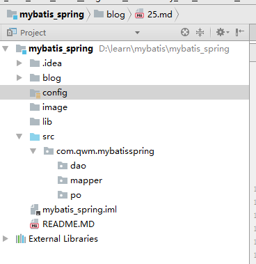
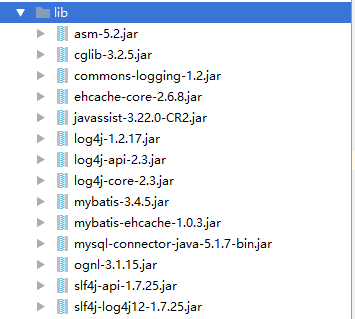
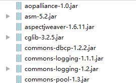
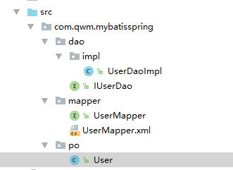

[TOC]

# SSH与SSM学习之MyBatis25——mybatis和spring整合之基本项目创建


## 一、mybaits和spring整合的思路

1 让spring管理SqlSessionFactory

2
>   让spring管理mapper对象和dao
>
>	使用spring和mybatis整合开发mapper代理及原始dao接口
>
>	自动开启事务，自动关闭 sqlsession.

3 让spring管理数据源( 数据库连接池)


---

## 二、创建整合工程

如图




----

## 三、导入jar包

导入的jar包如下

1 mybatis本身的jar

2 数据库驱动包

3 spring的jar包和连接池jar包

4 spring和mybatis的整合包（从mybatis的官方下载）


### 3.1 mybatis本身的jar 和数据库启动包

如图




### 3.2 mybatis本身的jar 和数据库启动包




### 3.3 spring和mybatis的整合包

```
mybatis-spring-1.3.0.jar
```

这些包之间版本的关系是


地址

[http://www.mybatis.org/spring/](http://www.mybatis.org/spring/)

如果发生下面的错误，就是 **mybatis-spring**  版本不对应

```java
java.lang.AbstractMethodError: org.mybatis.spring.transaction.SpringManagedTransaction.getTimeout()Ljava/lang/Integer;
.............
```

---

## 四、导入相关的类

从之前的项目导入项目类，导入以后，如图





---

## 五、log4j.properties

添加log4j.properties，添加位置是

```
config/log4j.properties
```

内容是：

```
# Global logging configuration\uff0c\u5efa\u8bae\u5f00\u53d1\u73af\u5883\u4e2d\u8981\u7528debug
log4j.rootLogger=DEBUG, stdout
# Console output...
log4j.appender.stdout=org.apache.log4j.ConsoleAppender
log4j.appender.stdout.layout=org.apache.log4j.PatternLayout
log4j.appender.stdout.layout.ConversionPattern=%5p [%t] - %m%n
```


---

## 六、db.properties


添加db.properties，添加位置是

```
config/db.properties
```

内容是：

```
jdbc.driver=com.mysql.jdbc.Driver
jdbc.url=jdbc:mysql://localhost:3306/mybatis
jdbc.username=root
jdbc.password=xm123456
```


---

## 七、SqlMapConfig.xml

添加 SqlMapConfig.xml，添加位置是

```
config/sqlmap/SqlMapConfig.xml
```

内容是：

```xml
<?xml version="1.0" encoding="UTF-8" ?>
<!DOCTYPE configuration
        PUBLIC "-//mybatis.org//DTD Config 3.0//EN"
        "http://mybatis.org/dtd/mybatis-3-config.dtd">
<configuration>

    <typeAliases>
        <package name="com.qwm.mybatisspring.po"/>
    </typeAliases>

    <!--加载映射文件-->
    <mappers>
        <mapper resource="sqlmap/User.xml"/>
        <!-- 批量mapper配置
        通过package进行自动扫描包下边的mapper接口，
        要求：需要mapper.xml和mapper.java同名并且在一个目录 中
        -->
        <package name="com.qwm.mybatisspring.mapper"/>
    </mappers>
</configuration>
```


---

## 八、applicationContext.xml

主要的操作就是

1、数据源（dbcp连接池）
2、SqlSessionFactory
3、mapper或dao


```xml
<beans xmlns="http://www.springframework.org/schema/beans"
       xmlns:xsi="http://www.w3.org/2001/XMLSchema-instance" xmlns:mvc="http://www.springframework.org/schema/mvc"
       xmlns:context="http://www.springframework.org/schema/context"
       xmlns:aop="http://www.springframework.org/schema/aop" xmlns:tx="http://www.springframework.org/schema/tx"
       xsi:schemaLocation="http://www.springframework.org/schema/beans
		http://www.springframework.org/schema/beans/spring-beans-4.3.xsd
		http://www.springframework.org/schema/mvc
		http://www.springframework.org/schema/mvc/spring-mvc-4.3.xsd
		http://www.springframework.org/schema/context
		http://www.springframework.org/schema/context/spring-context-4.3.xsd
		http://www.springframework.org/schema/aop
		http://www.springframework.org/schema/aop/spring-aop-4.3.xsd
		http://www.springframework.org/schema/tx
		http://www.springframework.org/schema/tx/spring-tx-4.3.xsd ">

    <!-- 加载配置文件 -->
    <context:property-placeholder location="classpath:db.properties" />
    <!-- 数据库连接池 -->
    <bean id="dataSource" class="org.apache.commons.dbcp.BasicDataSource"
          destroy-method="close">
        <property name="driverClassName" value="${jdbc.driver}" />
        <property name="url" value="${jdbc.url}" />
        <property name="username" value="${jdbc.username}" />
        <property name="password" value="${jdbc.password}" />
        <property name="maxActive" value="10" />
        <property name="maxIdle" value="5" />
    </bean>


    <!-- SqlsessionFactory -->
    <bean id="sqlSessionFactory" class="org.mybatis.spring.SqlSessionFactoryBean">
        <!-- 数据源 -->
        <property name="dataSource" ref="dataSource"/>
        <!-- mybatis配置文件 -->
        <property name="configLocation" value="classpath:mybatis/SqlMapConfig.xml"/>
    </bean>


</beans>
```


---

## 九、源码下载

[https://github.com/wimingxxx/mybatis_spring](https://github.com/wimingxxx/mybatis_spring)


[https://github.com/wimingxxx/mybatislearn](https://github.com/wimingxxx/mybatislearn)


